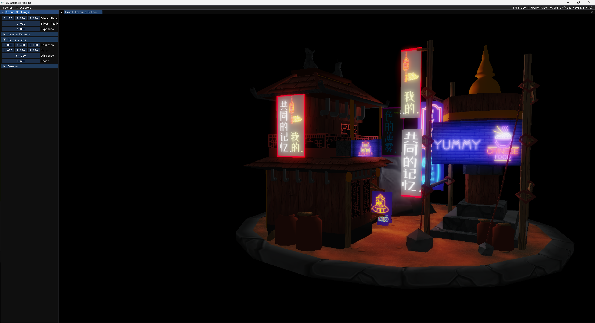

# Physically Based Bloom | A2 3D Graphics Programming

___
A second year project where we had to create a graphics program using OpenGL. The project focussed on both deferred 
rendering with physically based bloom from Call of Duty: Advanced Warfare. The project has the following features:
- Directional Lighting
- Point Lighting
- Physically Based Bloom
- Mipmap Debugger (for bloom)
- Deferred Rendering
- Obj Loader
- Oct-tree Collision Detection
- Impulse Response

## Bloom
Bloom takes overly bright areas of an image and makes them glow. This is achieved by blurring the image numerous times 
in combination with downsampling and upsampling. The bloom pipeline will match Call of Duty: Advanced Warfare (2014).

The bloom shaders will access sequential mipmaps levels as each up or down sample pass doubles and halves the image size 
respectively. Downsampling will take the previous down sample as an input to progressively blur the image. Once 
downsampling has reached a small enough mipmap level, upsampling will begin. Upsampling takes the previous upsample and 
the equivalent sized down sample.

Once the bloom pass has finished, it is then additively blended back onto the original image and tone mapped 
accordingly. 

You can check out the implementation for bloom here: 
- [Bloom.cpp](src/rendering/post-processing/Bloom.cpp)
- [PreFilter.frag](res/shaders/post-processing/pre-filter/PreFilter.frag)
- [BloomDownSample.frag](res/shaders/post-processing/BloomDownSample.frag)
- [BloomUpSample.frag](res/shaders/post-processing/BloomUpSample.frag)
- [BloomComposite.frag](res/shaders/post-processing/BloomComposite.frag)